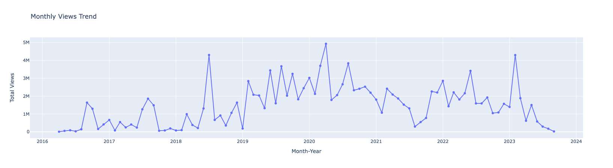

# Exploring YouTube: A Data Analysis of Channel Information using Python and the YouTube API

## Applicable Users:

This tool can be proficiently **utilised** by a diverse range of **professionals** including **Content Creators**, **Social Media Analysts**, **Digital Marketers**, and **Business Strategists** seeking to **refine** their content **deployment strategies**, **optimise** audience **engagement**, and **enhance brand presence** across **digital** platforms. Whether **fine-tuning** content for **maximum impact** or **harnessing insights** to drive **business innovation**, users from various domains can **leverage** this tool to **achieve** their **unique objectives** and **elevate** their **digital endeavors**.

## Overview

Everyone loves watching **YouTube**, but what if we could **transform** your favorite channels into **valuable** sources of **analytics** and **insights**? By **extracting information** such as **view counts**, **titles**, and **like counts**, we can uncover **valuable trends** and **patterns** in the content creation industry. In today's **digital era**, where everyone aspires to be a **YouTube creator** or **content creator** due to its numerous benefits, **understanding** the **dynamics** of popular channels can be a game-changer.

This **project** dives deep into the **analysis** of a specific **YouTube channel** - **Gauging Gadgets**. This channel is primarily focused on the exciting world of **tech**, **gadgets**, and **reviews**. Through **Python** and the **YouTube API**, we'll explore various aspects of this channel to **gain valuable insights** and **uncover hidden opportunities**.

## Methodology

**Data Extraction**: **Utilising** the **YouTube API**, we fetch comprehensive information about the **Gauging Gadgets** channel, including **video details**, **view counts**, **likes**, and more.

## Dataset Information:

|   #   | Column          | Non-Null Count  | Dtype     |
|-------|-----------------|------------------|-----------|
|   0   | video_id        | 1685 non-null   | object    |
|   1   | channelTitle    | 1685 non-null   | object    |
|   2   | title           | 1685 non-null   | object    |
|   3   | description     | 1685 non-null   | object    |
|   4   | tags            | 1670 non-null   | object    |
|   5   | publishedAt     | 1685 non-null   | object    |
|   6   | viewCount       | 1685 non-null   | int64     |
|   7   | likeCount       | 1684 non-null   | float64   |
|   8   | favouriteCount  | 0 non-null      | float64   |
|   9   | commentCount    | 1685 non-null   | int64     |
|  10   | duration        | 1685 non-null   | object    |
|  11   | definition      | 1685 non-null   | object    |
|  12   | caption         | 1685 non-null   | bool      |

**Data Cleaning**: **Cleaned** and **Pre-processed** the **collected data** to ensure **accuracy** and **consistency** in our **analysis**.

**Data Visualisation**: Through **data visualisation techniques**, we present the channel's **performance trends**, **top-performing videos**, and **audience engagement** in an easily digestible format.

**WordClouds** is a **Powerful Tool** for **Enhanced SEO** and **Data-Driven** **Decision-Making**

**WordClouds** can help **content creators** in the same **niche** and **improve** their **SEO** efforts by revealing relevant keywords. They **enable data refinement**, **eliminating** the **irrelevant** and allowing for more **informed decisions**, **reducing** guesswork in **SEO** and **content creation**.

<table>
  <tr>
    <td></td>
    <td></td>
    <td></td>
  </tr>
</table>

**Scatter Plot**

Let’s **examine** whether there are any **correlations** among the following **variables**: **‘viewCount’**, **‘likeCount’**, and **‘commentCount’**. By **exploring** potential **relationships** between these factors, we can **gain** a **deeper understanding** of their **interconnectedness** and **influence** on each other, thereby **extracting meaningful insights** from our **data**.

**Application**

**Content Strategy Adjustment**:

Discovering a **strong correlation** between these variables may help in **refining content strategies**. For example, if videos with higher likes also have higher comments, focusing on **creating likable content** may subsequently **increase** the comment count, **fostering community interaction**.

**Resource Allocation**:

By **identifying** which variable has the most **significant** impact on the others, **resources** like **time** and **money** can be **allocated more efficiently**. For example, if comments have a **stronger correlation** with views, **encouraging user interaction and discussions** may be **more beneficial** than solely focusing on likes.
